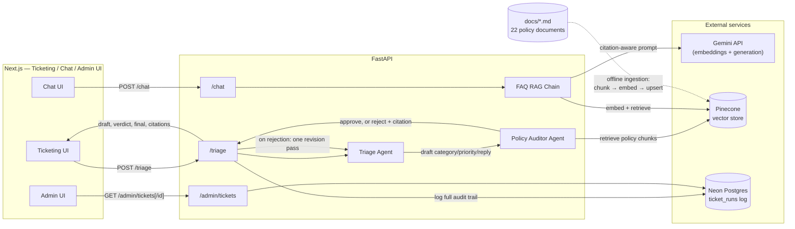

# Marula Ticket Triage Assistant

A two-agent maintenance ticket triage system for a fictional South African property and facilities management
company. One agent classifies an incoming ticket and drafts a response; a second, independent agent checks that
classification against the company's actual policy documents and can reject and correct it before it's accepted.
A tenant-facing FAQ chatbot and an internal admin view sit alongside it, sharing the same document corpus and
retrieval pipeline.

> **Marula Property Group is entirely fictional.** The company, its policies, trades, and every document in
> [`docs/`](./docs) were invented for this project. None of it describes a real business, and nothing in it is
> real property management, legal, or safety advice.

---

## Why this exists

This is a portfolio project built to demonstrate a specific pattern: a system where one LLM agent's output is
independently checked by a second agent, grounded in retrieval, before it's accepted — rather than a single
agent's output being trusted outright. The Ticketing and Admin UIs exist to make that check visible: every run
shows the first-pass classification, the Auditor's verdict, and the final result, so the mechanic isn't just
happening somewhere in a log file.

## Architecture



**Ticket flow (`POST /triage`):** the Triage Agent reads the raw ticket and outputs a category, priority, SLA
target, and a drafted tenant-facing reply — with no retrieval of its own, only a short category/priority
reference embedded in its prompt. The Policy Auditor Agent then builds a retrieval query from the ticket text
*plus* the Triage Agent's stated classification, retrieves the top-7 matching policy chunks from Pinecone, and
checks the classification strictly against that context. It never sees the Triage Agent's reasoning, only its
conclusion. If it approves, the first-pass result is final. If it rejects, it returns a citation and a correction,
the Triage Agent gets exactly one revision pass fed that feedback, and the corrected result becomes final. Every
run — draft, verdict, and final result — is logged to Neon regardless of outcome.

**FAQ flow (`POST /chat`):** a separate, single-agent RAG chain over the same Pinecone index, used for general
policy questions rather than ticket classification. Below a calibrated similarity threshold, or if the model
itself signals the retrieved context doesn't answer the question, it returns a fixed "not found" response instead
of generating from irrelevant context.

**Ingestion is offline**, not part of either live request path: a standalone script chunks every document in
`docs/` along its own numbered section boundaries, embeds each chunk, and upserts it to Pinecone with metadata
(`source_document`, `section`, raw text) so a retrieved chunk can be cited and returned directly.

## Key engineering decisions

- **The confidence threshold was calibrated against this corpus, not carried over from a similar project.** An
  earlier version of this pipeline (a different RAG chatbot, same technique) used a threshold of 0.62. Testing
  that same value here against Marula's documents showed a different score distribution: out-of-domain questions
  topped out at 0.627, in-domain questions scored 0.704+. The threshold here is 0.65, set from this corpus's own
  measured gap.
- **A retrieval-completeness bug was found and fixed during testing, not assumed away.** The question "who pays
  for a blocked drain caused by grease" was retrieving a chunk that listed the example (§3, "improper disposal")
  but not the general principle that connects "tenant responsibility" to "tenant pays" (§1) — that section sat
  just outside the top-5 results for that specific phrasing. A prompt change alone (explicitly telling the model
  to reason past wording mismatches) did not fix it, and reproduced consistently across three reruns. Increasing
  `top_k` from 5 to 7 for the chatbot resolved it. The failure was diagnosed by inspecting the exact retrieved
  context passed to the model, not by guessing at the prompt.
- **The Policy Auditor's rejections are real, not staged.** During development, a ticket describing a bee swarm
  at the building entrance was first classified Emergency by the Triage Agent; the Auditor rejected it, citing
  the Pest Control Policy's explicit "Urgent, not Emergency" rule, and the revision pass produced the correct
  classification. Verified again later with a different ticket ("entire unit has no power, neighbours' units are
  fine") through the actual Ticketing UI and Admin UI, not just the API: Triage assigned Emergency, the Auditor
  rejected it citing the Electrical Maintenance & Safety Policy's "total loss of power to a unit is Urgent" rule,
  and both UIs rendered the rejected state correctly on the first real occurrence — the rejected-state styling had
  not been exercised by an actual model rejection before that check.
- **A 9/10 eval result is reported as 9/10, not rounded up in the write-up.** The one miss ("paint in the lobby is
  scuffed," expected `Common Area/Grounds`, classified `Structural/General Building`) is a genuine ambiguity in
  the category taxonomy itself — nothing in the docs disambiguates general building maintenance from common-area
  maintenance for a case like cosmetic paint. It's left as a documented limitation rather than patched to force a
  clean number.

## Evaluation results

10 tickets spanning 6 of the 10 trade categories and all three priority tiers, expected category/priority
cross-checked against the actual document text before being written into the eval set.

| Metric | Result |
|---|---|
| Fully correct (category + priority both match final result) | 9/10 (90%) |
| Category accuracy | 9/10 (90%) |
| Priority accuracy | 10/10 (100%) |
| Policy Auditor rejected and corrected the first pass | 2/10 (20%) |

The rejection rate is from one run, not a stable measurement — generation isn't fully deterministic, so which
tickets the Triage Agent misclassifies on its first pass varies between runs (the bee-swarm ticket used as the
step 5 example elsewhere in this README was misclassified in that manual test but classified correctly in the
eval run behind this table). The mechanic itself — the Auditor catching and correcting a wrong first pass when
one occurs — is what's being demonstrated, not a fixed error rate.

Scored against the chain's final output, after any Auditor-driven revision — the Auditor's role is to catch and
correct a wrong first pass, so a corrected case counts as a system success. Full per-ticket breakdown, including
which ticket produced the one miss and which two were corrected: [`backend/eval/eval_results.md`](./backend/eval/eval_results.md).
Re-run it yourself with `cd backend && python scripts/eval.py`.

## Tech stack

| Layer | Choice |
|---|---|
| Frontend | Next.js (TypeScript) + Tailwind + shadcn/ui |
| Backend | Python + FastAPI |
| Orchestration | LangChain — structured-output agent chains |
| Generation | Gemini (`gemini-3.5-flash-lite`) |
| Embeddings | Gemini (`gemini-embedding-001`) |
| Vector store | Pinecone (serverless) |
| Relational DB | Neon Postgres — ticket run log |

## Project structure

```
docs/               22 fictional policy documents (the corpus)
frontend/
  app/               Ticketing UI (/), Chat UI (/chat), Admin UI (/admin, /admin/[id])
backend/
  app/               FastAPI app: /triage, /chat, /admin endpoints; agents, retrieval, RAG chain, DB
  scripts/           CLI tools: ingest.py, eval.py, test_agents.py, test_retrieval.py, test_rag_chain.py
  eval/              Evaluation set + results
```

## Setup

Requires: Node.js 20+, Python 3.12+, and API keys/accounts for Gemini, Pinecone, and Neon.

**Backend**
```bash
cd backend
python -m venv .venv
.venv/Scripts/activate   # or source .venv/bin/activate on macOS/Linux
pip install -r requirements.txt
```

Create `backend/.env`:
```
GEMINI_API_KEY=...
PINECONE_API_KEY=...
PINECONE_INDEX_NAME=marula-facilities-policies
NEON_DATABASE_URL=postgresql://...
```

Create the ticket run log table in Neon:
```sql
create table ticket_runs (
  id uuid primary key default gen_random_uuid(),
  ticket_text text not null,
  agent1_category text,
  agent1_priority text,
  agent1_draft text,
  auditor_verdict text,
  auditor_critique text,
  final_category text,
  final_priority text,
  final_response text,
  citations text[],
  created_at timestamptz not null default now()
);
```

Then run ingestion once to populate Pinecone:
```bash
python scripts/ingest.py
```

Start the API:
```bash
uvicorn app.main:app --reload --port 8000
```

**Frontend**
```bash
cd frontend
npm install
```

Create `frontend/.env.local`:
```
NEXT_PUBLIC_API_URL=http://localhost:8000
```

```bash
npm run dev
```

This project runs locally; it is not currently deployed.

## API

`POST /triage`
```json
// Request
{ "ticket_text": "There's no hot water in my unit since this morning." }

// Response
{
  "triage": { "category": "Plumbing", "priority": "Urgent", "sla_target": "...", "draft_reply": "..." },
  "auditor": { "verdict": "approved", "citation": "Priority Classification Policy §3", "critique": "", "corrected_category": "", "corrected_priority": "" },
  "final": { "category": "Plumbing", "priority": "Urgent", "sla_target": "...", "draft_reply": "..." },
  "citations": ["Priority Classification Policy §3", "..."]
}
```

`POST /chat`
```json
// Request
{ "question": "Who pays for a blocked drain caused by grease going down the sink?" }

// Response
{
  "answer": "Based on the provided documents, a blocked drain caused by improper disposal...",
  "sources": [{ "document": "Lease Damage vs. Landlord Responsibility Policy", "section": "3" }]
}
```

`GET /admin/tickets` returns a summary list of past ticket runs; `GET /admin/tickets/{id}` returns the full audit
trail for one. Neither endpoint requires authentication — this is an internal-tool demo, not a public-facing
surface, and there is no rate limiting on any endpoint for the same reason.
